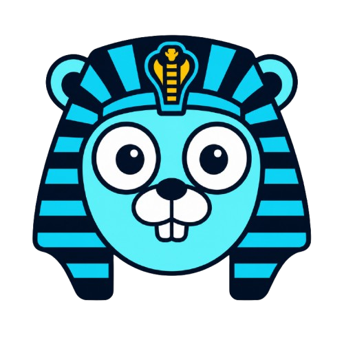

# Glyph



A terminal UI framework for Go.

Glyph provides a small set of composable primitives — containers, borders,
text, lists, and focusable widgets — for building interactive terminal
applications without wiring up rendering, layout, and input handling by
hand.

## Features

- **Composable widgets.** A single `Container` type parameterized by a
  `LayoutPolicy` replaces the need for separate container types — free
  positioning and stacked layouts are both just configuration.
- **Style inheritance.** Colors and styles cascade from parent to child
  automatically, with `Transparent` as an explicit "inherit" value.
- **Focus management.** Tab/Enter/Esc navigation, including drilling into
  nested focusable containers and back out.
- **Self-refreshing components.** Any widget can update its own state from
  a background goroutine and trigger a redraw.
- **Two render modes.** Fixed frame rate, or on-demand redraw only when
  something actually changes.

## Installation

```bash
go get github.com/dmsRosa6/glyph
```

## Quick start

```go
package main

import (
	"github.com/dmsRosa6/glyph/app"
	"github.com/dmsRosa6/glyph/core"
	"github.com/dmsRosa6/glyph/render"
)

func main() {
	a, err := app.NewApp(app.AppConfig{
		Bg:         &core.Black,
		RenderMode: render.FixedFPS,
	})
	if err != nil {
		panic(err)
	}

	// build your UI, then:
	a.Run()
}
```

See the `main/` directory for a fuller example, including bordered boxes,
a focusable widget tree, a stacked list, and a self-updating clock.

## Widgets

- **Rect** — a filled rectangle of a single character, with optional
  clipping.
- **Text** — a single line of styled text. Can be updated at runtime,
  including from a background goroutine, and will ask for a redraw when
  it changes.
- **Border** — draws a frame (corners, edges) around a bounds. Comes with
  a few built-in styles (single line, double line, thick, rounded) and
  supports custom ones.
- **Bordered** — wraps any single widget with a `Border`. This is the
  general "frame around something" primitive.
- **Box** — a convenience constructor for the common case: a bordered,
  padded container that holds freely-positioned children.
- **Button** — a focusable widget with a bound action. Rendering is not
  yet implemented.
- **FocusableBox** — a bordered, padded, focusable container. Supports a
  distinct style while focused, and can hold further focusable children
  that `FocusManager.Enter()` can drill into.
- **List** — a container with a stacked layout, plus a convenience
  method for adding bordered, padded rows.
- **Window** — a `Box` with a title overlaid on the border itself.

## Render modes

Passed as `RenderMode` in `app.AppConfig`.

- **FixedFPS** — redraws on a fixed timer regardless of whether anything
  changed. Simple and predictable, at the cost of drawing frames that
  don't need it.
- **OnDemand** — only redraws when something explicitly asks for it. I need to define better when its needed to be called :)

## The `framework` package

`framework` holds the shared contracts every other package depends on,
with no rendering or terminal logic of its own.

- **interfaces.go** — the core interfaces: `Drawable` (can be drawn and
  positioned), `Focusable` (can take input and focus), `Composable` (can
  hold children), `Layoutable`, `Clippable`, and `ChildrenLister` (lets a
  container expose its children without callers needing to know its
  concrete type).
- **style.go** — `Style` and `ResolveStyle`, the parent/child style
  inheritance logic. `Transparent` is the sentinel that means "inherit."
- **layout.go** — `Anchor` and axis resolution for positioning a widget
  within its parent (start, center, end, or an explicit position).
- **layoutpolicy.go** — `LayoutPolicy` and its two implementations,
  `FreeLayout` (children keep their own declared position) and
  `StackLayout` (children stack top to bottom).
- **event.go** — `Event` and `Key`, the input event types produced by
  `input.Manager` and consumed by focusable widgets.


## Still Adding stuff...